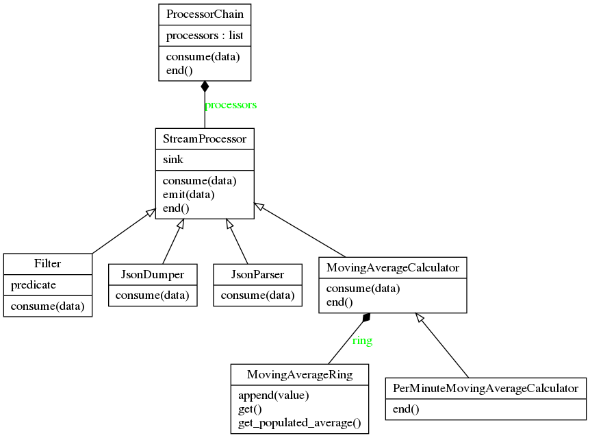

# enki - translation event processor

Calculates moving average of translation events.

_Naming_: In the Sumerian epic entitled _Enmerkar and the Lord of Aratta_, people are imploring **Enki** to restore the one language, hence unbabeling the [confusion](https://en.wikipedia.org/wiki/Enki#Confuser_of_languages).

## Quick Start

Tested with python 3.8.

```bash
make install
enki -h
```

```
usage: enki [-h] --input_file INPUT_FILE --window_size WINDOW_SIZE

enki - translation event processor

optional arguments:
  -h, --help            show this help message and exit
  --input_file INPUT_FILE
                        input file name, jsonl
  --window_size WINDOW_SIZE
                        moving average window size
```

## Testing

Building the docker container will run [unit tests](tests) and [CLI tests](tests/data_tests.sh).

CLI tests execute `enki` for each json file in [data](tests/data) and expect the produced result to be exactly equal to the corresponding `*.expected` file.

```bash
docker build .
```

## Architecture

_enki_ is designed as a stream processing library and a CLI tool that can operate according to the [specifications](SPEC.md).

The architecture provides maintainability, ease of change and extensibility - all while being simple.



The library has the [StreamProcessor](enki/StreamProcessor.py) and the [ProcessorChain](enki/ProcessorChain.py) classes as entry points. Implementations of the `StreamProcessor` class can be configured to run one after another, passing their input to their immediate follower, using the `ProcessorChain`.

New types of `StreamProcessor` implementations can be added inside or outside the library to be used with the CLI application with ease. As an example, [Filter](enki/Filter.py) class is added that filters out the stream based on a predicate.

Input and output to the library does not have to be in [JSONL](http://jsonlines.org/) format, a new format can be supported by adding the parser and/or dumper type to the processor chain in the [cli main](enkicli/__main__.py). If your data is already a python dict, no need to use [JsonParser](enki/JsonParser.py) and [JsonDumper](enki/JsonDumper.py) as intermediate stream processors operate on python dicts.

Parsing, processing and writing output is implemented in the [cli main](enkicli/__main__.py):`get_moving_average_chain` method as:

```py
def get_moving_average_chain(window_size: int):
    return ProcessorChain(print, [
        lambda sink: JsonParser(sink),
        lambda sink: Filter(sink, lambda x: x["event_name"] == "translation_delivered"),
        lambda sink: PerMinuteMovingAverageCalculator(
            sink,
            window_size,
            lambda x: "%s:00" % x["timestamp"][:16],
            lambda x: x["duration"], "date", "average_delivery_time"),
        lambda sink: JsonDumper(sink),
    ])
```

Chain executes top-down, sinks of the processors are tied to the following processor in reverse order in _ProcessorChain_ constructor.

## Data flow

As per the [specifications](SPEC.md), a jsonl file containing translation events is processed:


1. `JsonParser` parses each line in the jsonl file to python dictionaries.
2. `Filter` only allows `translation_delivered` events to pass through.
3. `PerMinuteMovingAverageCalculator` is based on `MovingAverageCalculator`, it calculates a version of moving average based on the specification with the passed `window_size`.

   `MovingAverageCalculator` does not produce values when there is no data, whereas `PerMinuteMovingAverageCalculator` produces values for minutes that do not have data.

4. `JsonDumper` writes emitted moving average results to stdout.

## Further direction

- Accept input from stdin.
- Accept processor chain configuration from command line to allow custom stream processing.
- Option to ignore errors that happen during processing.
